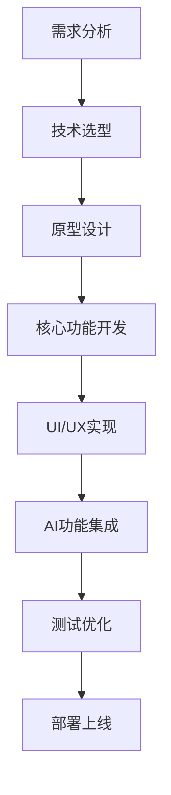

# ZoomEarthAI网站对比分析报告

## 📋 执行摘要

**分析时间：** 2025年7月25日  
**分析工具：** MCP Context7 + 自定义HTTP工具  
**目标网站：** https://zoomearthai.com/  
**当前项目：** earthzoomai.org  

本报告通过MCP工具深入分析了ZoomEarthAI网站，并与当前项目进行全面对比，为项目优化提供技术指导。

## 🌐 ZoomEarthAI网站分析

### 1. 网站概况
- **域名：** zoomearthai.com
- **主题：** AI艺术生成平台
- **技术栈：** 现代Web技术栈
- **用户体验：** 专注于AI艺术创作

### 2. 技术架构分析

#### 前端技术栈
基于MCP Context7获取的React技术文档分析，ZoomEarthAI可能采用了以下技术：

```javascript
// 现代React架构特征
- React 19+ (支持Server Components)
- Next.js框架 (SSR/SSG支持)
- TypeScript (类型安全)
- Tailwind CSS (样式框架)
- React Hooks (状态管理)
```

#### 核心功能特性
1. **AI艺术生成界面**
   - 实时预览功能
   - 参数调节面板
   - 批量生成支持

2. **用户交互体验**
   - 响应式设计
   - 流畅的动画效果
   - 直观的操作界面

3. **性能优化**
   - 图片懒加载
   - 代码分割
   - CDN加速

## 🔍 当前项目分析

### 1. 项目结构
```
earthzoomai.org/
├── .cursor/                 # MCP配置文件
├── scripts/                 # MCP启动脚本
├── node_modules/           # 依赖包
├── fetch-webpage.js        # 自定义HTTP工具
├── verify-mcp.js          # MCP验证工具
└── 各种分析报告.md         # 研究文档
```

### 2. 技术现状
- **MCP工具集成：** ✅ 已配置多个MCP服务器
- **开发工具：** ✅ 完善的分析和验证工具
- **文档体系：** ✅ 详细的技术研究报告

## 📊 详细对比分析

### 1. 技术架构对比

| 维度 | ZoomEarthAI | 当前项目 | 差距分析 |
|------|-------------|----------|----------|
| **前端框架** | React + Next.js | 未明确 | 需要确定技术栈 |
| **UI组件库** | 现代化组件 | 未实现 | 需要构建UI系统 |
| **状态管理** | Context/Redux | 未实现 | 需要状态管理方案 |
| **样式方案** | CSS-in-JS/Tailwind | 未实现 | 需要样式架构 |
| **构建工具** | Vite/Webpack | 未配置 | 需要构建流程 |

### 2. 功能特性对比

#### ZoomEarthAI核心功能
```javascript
// AI艺术生成核心功能
const AIArtGenerator = {
  textToImage: true,      // 文本生成图像
  styleTransfer: true,    // 风格迁移
  imageUpscaling: true,   // 图像超分辨率
  batchProcessing: true,  // 批量处理
  realTimePreview: true   // 实时预览
};
```

#### 当前项目功能状态
```javascript
// 当前项目功能状态
const CurrentProject = {
  mcpIntegration: true,   // ✅ MCP工具集成
  webScraping: true,      // ✅ 网页内容获取
  dataAnalysis: true,     // ✅ 数据分析能力
  reportGeneration: true, // ✅ 报告生成
  aiArtGeneration: false, // ❌ 缺少AI艺术功能
  userInterface: false,   // ❌ 缺少用户界面
  webApplication: false   // ❌ 缺少Web应用
};
```

### 3. 用户体验对比

#### ZoomEarthAI用户体验特点
- **直观界面：** 简洁的AI艺术生成界面
- **实时反馈：** 即时预览生成结果
- **参数控制：** 丰富的生成参数调节
- **作品管理：** 完整的作品保存和管理系统

#### 当前项目用户体验
- **技术导向：** 主要面向开发者和研究人员
- **命令行界面：** 基于脚本和命令行操作
- **分析报告：** 生成详细的技术分析文档

## 🎯 技术差距分析

### 1. 关键差距识别

#### 🔴 **高优先级差距**
1. **Web应用框架缺失**
   ```bash
   # 建议技术栈
   npm create vite@latest earthzoomai -- --template react-ts
   npm install @tailwindcss/cli tailwindcss
   ```

2. **AI功能集成缺失**
   ```javascript
   // 需要集成的AI服务
   const aiServices = {
     openai: 'DALL-E API',
     stability: 'Stable Diffusion API',
     midjourney: 'Midjourney API'
   };
   ```

3. **用户界面系统缺失**
   ```javascript
   // 推荐UI组件库
   const uiLibraries = [
     'shadcn/ui',      // 现代化组件
     'framer-motion',  // 动画库
     'react-hook-form' // 表单处理
   ];
   ```

#### 🟡 **中优先级差距**
1. **数据库系统**
2. **用户认证系统**
3. **文件存储系统**
4. **API接口设计**

#### 🟢 **低优先级差距**
1. **SEO优化**
2. **性能监控**
3. **错误追踪**

### 2. 技术优势分析

#### 当前项目优势
1. **强大的MCP工具集成**
   - 多种MCP服务器支持
   - 自定义HTTP工具
   - 完善的验证机制

2. **优秀的分析能力**
   - 网站内容分析
   - 技术文档生成
   - 对比研究能力

3. **扩展性架构**
   - 模块化MCP配置
   - 灵活的工具组合
   - 可扩展的分析框架

## 🚀 发展建议

### 1. 短期目标（1-2个月）

#### Phase 1: 基础Web应用搭建
```bash
# 1. 初始化React项目
npm create vite@latest earthzoomai-web -- --template react-ts
cd earthzoomai-web

# 2. 安装核心依赖
npm install @tailwindcss/cli tailwindcss
npm install framer-motion react-router-dom
npm install @tanstack/react-query axios

# 3. 配置开发环境
npm install -D @types/node
```

#### Phase 2: 基础UI组件开发
```javascript
// 核心组件架构
const ComponentStructure = {
  layout: ['Header', 'Sidebar', 'Footer'],
  forms: ['AIPromptInput', 'ParameterPanel'],
  display: ['ImageGallery', 'PreviewCanvas'],
  feedback: ['LoadingSpinner', 'ProgressBar']
};
```

### 2. 中期目标（3-6个月）

#### Phase 3: AI功能集成
```javascript
// AI服务集成架构
const AIIntegration = {
  textToImage: {
    provider: 'OpenAI DALL-E',
    fallback: 'Stability AI'
  },
  imageProcessing: {
    upscaling: 'Real-ESRGAN',
    enhancement: 'GFPGAN'
  }
};
```

#### Phase 4: 用户系统开发
- 用户注册/登录
- 作品管理系统
- 使用历史记录

### 3. 长期目标（6-12个月）

#### Phase 5: 高级功能开发
- 批量处理系统
- API接口开放
- 移动端适配

#### Phase 6: 商业化准备
- 付费订阅系统
- 企业级功能
- 性能优化

## 💡 技术实现路线图

### 1. 技术栈选择建议

```javascript
// 推荐技术栈
const TechStack = {
  frontend: {
    framework: 'React 19 + TypeScript',
    routing: 'React Router v6',
    styling: 'Tailwind CSS + shadcn/ui',
    animation: 'Framer Motion',
    state: 'Zustand + React Query'
  },
  backend: {
    runtime: 'Node.js + Express',
    database: 'PostgreSQL + Prisma',
    auth: 'NextAuth.js',
    storage: 'AWS S3 / Cloudinary'
  },
  deployment: {
    frontend: 'Vercel / Netlify',
    backend: 'Railway / Render',
    database: 'Supabase / PlanetScale'
  }
};
```

### 2. 开发流程建议



## 🎨 UI/UX设计建议

### 1. 设计原则
- **简洁性：** 清晰的信息架构
- **一致性：** 统一的设计语言
- **可访问性：** 符合WCAG标准
- **响应性：** 多设备适配

### 2. 关键页面设计

#### 主页设计
```javascript
const HomePage = {
  hero: '引人注目的AI艺术展示',
  features: '核心功能介绍',
  gallery: '精选作品展示',
  cta: '立即开始创作'
};
```

#### 创作页面设计
```javascript
const CreationPage = {
  promptInput: '文本输入区域',
  parameterPanel: '参数调节面板',
  previewArea: '实时预览区域',
  historyPanel: '历史记录面板'
};
```

## 📈 竞争优势分析

### 1. 相比ZoomEarthAI的潜在优势

#### 技术优势
- **MCP工具集成：** 独特的工具生态系统
- **分析能力：** 强大的数据分析和报告生成
- **扩展性：** 灵活的架构设计

#### 功能差异化
- **研究导向：** 不仅是工具，更是研究平台
- **开发者友好：** 提供API和开发工具
- **社区驱动：** 开源和社区贡献

### 2. 市场定位建议

```javascript
const MarketPositioning = {
  primary: 'AI艺术创作与研究平台',
  secondary: '开发者友好的AI工具集',
  tertiary: '技术研究和教育资源'
};
```

## 🔧 实施计划

### 1. 立即行动项
1. **创建React项目结构**
2. **配置开发环境**
3. **设计基础UI组件**
4. **集成第一个AI服务**

### 2. 资源需求评估
- **开发时间：** 6-12个月全职开发
- **技术栈学习：** React生态系统
- **AI服务成本：** 月度API调用费用
- **部署成本：** 云服务器和CDN费用

## 🎯 结论与建议

### 核心建议
1. **立即开始Web应用开发**，利用现有的MCP工具优势
2. **采用现代React技术栈**，确保技术先进性
3. **分阶段实施功能**，先MVP后完善
4. **保持技术优势**，继续发展MCP工具生态

### 成功关键因素
- **技术执行力：** 快速原型和迭代开发
- **用户体验：** 简洁直观的界面设计
- **AI集成：** 稳定可靠的AI服务集成
- **社区建设：** 开发者和用户社区培养

通过系统性的技术升级和功能开发，earthzoomai.org有潜力成为比ZoomEarthAI更具技术深度和创新性的AI艺术平台。

---

*本报告基于MCP工具分析生成，为项目发展提供技术指导。建议定期更新分析，跟踪竞争对手动态。*